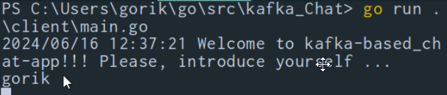
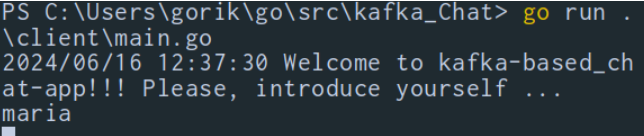
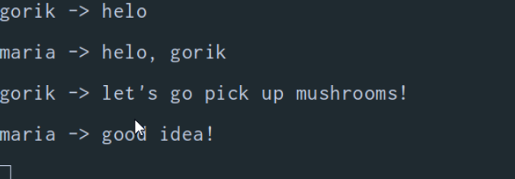

# Simple chat via kafka

Simple chat app based on kafka. (Replica of [jonathanlareau](https://github.com/jonathanlareau/kafka-chat) project, thank you!!!)

## How to start
Docker compose - that's all you need to start chat-app. Just command :
```bash
docker compose up
```
Then you can run client as many as you want :
```bash
go run client/main.go
```

## Usage's screenshots

After client's running enter your nickname:


And start to chat:


### Great thank you, [**jonathanlareau**](https://github.com/jonathanlareau/kafka-chat)


